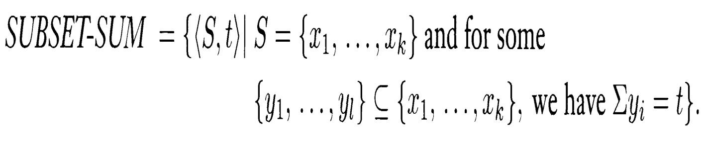
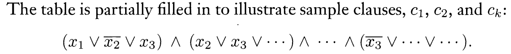
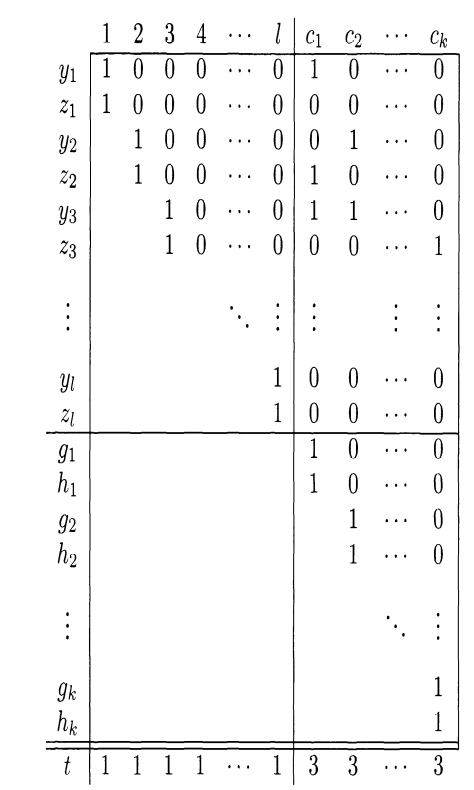

## Algorithms Analysis and Design

#### Week 11  - Diary 

#### Ayan Agrawal (2020101034)

### Lecture 16 : More examples of completeness

#### Problems for the class :

- Vertex cover and subset sum problem
- Proving vertex cover in NP-complete using 3-SAT
- Proving subset sum problem is NP- Complete using 3- SAT.

### Vertex cover problem :

The vertex cover problem is one of the few NP problems that can be shown to be NP
Complete using the well known 3 SAT Problem. The problem statement :

*If we have an un-directed graph $G$, then vertex cover of $G$ is a subset of nodes where every edge of $G$ touches at least one of those nodes.* 

Vertex cover also deals with the optimization question of "Is it possible to have a vertex cover for $G$, given a number $k$". 

$\text{Vertex cover} = \{<G,k> | \text{ G is an un-directed graph that has a k-node vertex cover} \}$    

#### **Proof that Vertex cover problem is NP-complete:** 

We'll try to make reduction from the 3-SAT problem to Vertex Cover problem in polynomial complexity.

We will map a boolean formula $\phi$  to the graph $G$ and the value $k$ .

- We create an edge linking two nodes for each variable $x$ in $\phi$ and label the two nodes as $x$ and $x'$. Now we map $x$ to **true** meaning it corresponds to selecting the left node for the vertex cover while $x$' to **false** meaning it corresponds to the right node .
- Consider a triple of 3 nodes, each labelled with one of the clause's three literals. These 3 nodes are linked to each other as well as to the nodes in the variable gadgets with the same labels. As a result, the total number of nodes in $G$ is $2m+3l$, with $\phi$ having $m$ variables and $l$ clauses. Now we assume that $k$ is $m+2l$.

Now, we'll prove that this reduction will work only if $G$ has a vertex cover with $k$ nodes.

- In the vertex cover, 
  - We begin by placing the variable gadget nodes that correspond to the assignment's **true** literals.
  - Then, for each phrase, we select one true literal and insert the remaining two clause gadget nodes into the vertex cover.
  - There are now $k$ nodes in total. Because every variable gadget edge is clearly covered, all 3 edges within each clause gadget are covered, and all edges between variable and clause gadgets are covered, they cover all edges. As a result, $G$ has a $k$-node vertex cover.
- The vertex cover should contain 1 node in each variable gadget and 2 in each clause gadget to cover the edges of the variable gadgets and the three edges within the clause gadgets. There are no more nodes to be found.
- Assign **True** to the nodes of the variable gadgets that are in the vertex cover. This assignment fulfils the  requirements of $\phi$.
- As a result, one of the edges must be covered by a variable node, and we may reduce the vertex cover problem to 3-SAT.

### Subset Sum Problem :

This a simplified problem to undestand, the problem statement is :

"*Given an array of integers, determine if it is possible to have as sum of $T$ using a subset of array* "

A $3$-$CNF$ formula is to be used to build an instance of the subset sum problem contains a sub-set of the set, which sums to target $t$ only if the boolean formula $ϕ$
is satisfiable. We will call this sub collection as $T$.

Suppose $\phi$ has $l$ variables $x_1,x_2...x_l$ and $k$ clauses $c_1,c_2,.....c_k$.  

#### **Table filling :**

- For every boolean $\phi's$  formula variable $x_i$, we will have 2 special variables $y_i$ and $z_i$ . The $y_i$ goes to 1 for clause $c_j$ if it has $x_i$ , $z_i$ goes to 1, if clause $c_j$ has $x'_i$ . Both stay zero for that clause if variable is not present in that clause. 

- We can quickly realise that every column we will have three 1s, now we will do the selection, for every column(clause) we take $y_i$ only if $x_i$ is **true** and we only take $z_i$ only if the $x'_i$ is true. 

- The left side of the top half in the picture ensures that we only pick $y_i$ or $z_i$ for every clause and not both as that is not valid, in case we pick both, we will get a sum of 2 in that column, and that would not match the expected answer of 1 in that column. 

- Our **target sum** is : first $l$ digits are 1, and the next $k$ digits are 3. The bottom right digits are to ensure that we at least choose 1 to 3 variables which are **true** for each column to get a sum of 3 in that column, if we do not choose any **true** variable for a column, we can never ensure its sum is 3, as max sum possible would be only 2.

- Depending on how many variables we pick (**true** literals for $y_i$ and **false** for $z_i$ ) for every column, we choose which rows are to be picked in the bottom right table for every column. 

- Thus, this is a straightforward mapping to the 3-SAT Problem, because only by determining a specific solution to the boolean expression can we decide which rows should be chosen to ensure that the desired sum is met.

  

  Thus, *Subset Sum problem is an NP-Complete problem* as well. The rows that we finally picked is the subset to be picked in the subset problem.

> - **Summary : Both Set cover and subset sum problems are NP-complete probelms.**

