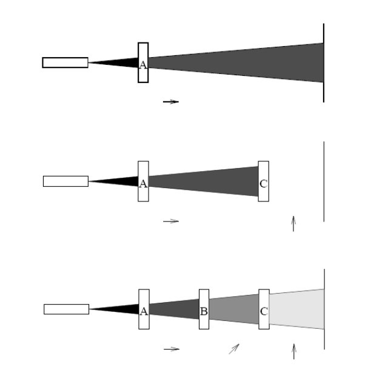

## Algorithms Analysis and Design

#### Week 12  - Diary 

#### Ayan Agrawal (2020101034)

### Lecture 17 : Quantum Algorithms

#### Problems for the class :

- Photon Experiment
- Qubits
- Quantum Mechanics
- No-cloning Theorem
- Quantum Entanglement
- Quantum gates and circuits
- Quantum Teleportation

### Photon Experiment

- We know that if light travels through two polarising filters at 90 degrees to each other, no light will pass through the second filter.
- When a third filter is placed in front of the second, light passes through the third filter, albeit at a lower intensity than the original.

As a result of this study, we can deduce that light acts differently than ordinary fluids, and that traditional physics and mathematics are insufficient to explain this phenomena.

### Qubits

- It's a unit vector in a 2-D complex vector space with a fixed basis. The linear superposition of a qubit's two orthonomal basis vectors can be used to express its general quantum state.

- These vectors are 

  ​													$\{|0>,1>\}$ 

  where,

  ​													$|0> = \begin{bmatrix}1\\0\end{bmatrix}$

  ​													$|0> = \begin{bmatrix}0\\1\end{bmatrix}$

  

- A pure qubit state/vector is a coherent superposition of the basis vectors. This means that a single qubit can be described by a linear combination of these 2 vectors:

  ​													$|\psi> = \alpha |0> + \beta|1>$

  where, 

  ​													$|\alpha|^2 + |\beta|^2 = 1$ 

  here, $\alpha$ and $\beta$ are complex numbers, called as **Probability amplitudes.**

  1. probability that measure values is $|0> = |\alpha|^2$ after which the state collapses to $|0>$. 
  2. probability that measure values is $|1> = |\beta|^2$ after which the state collapses to $|1>$. 

- Individual state spaces of $n$ particles combine classically through the cartesian product, but quantum states however combine through tensor product.

  - The space of all the states that may be created from its constituent states is the **Tensor product** of two states.

    - For example ,

      ​					$|00> = |0> \otimes |0> = \begin{bmatrix}1\\0\end{bmatrix} \otimes \begin{bmatrix}1\\0\end{bmatrix} = \begin{bmatrix}1& 1\\1&0\\0&1\\0&0\end{bmatrix} $ 

      An $n$ qubit system has $2^n$ basis vectors.

  

### Quantum mechanics

#### 1. Superposition Postulate

If a physical system can be in any of a variety of configurations, the most generic state is a mixture of all of them, with the amount of each arrangement being described by a complex number.

#### 2. Measurement Postulate

In any measurement of a qubit $|\psi>$  using the operator $\hat{A}$ , the only values that will be observed are the eigenvalues $a$, which satisfy the following eigenvalue equation. 

​															$\hat{A}\psi = a\psi$ 

#### 3. Collapse Postulate

A wave function collapse occurs in quantum mechanics when a wave equation that is initially in a superposition of several eigenstates is reduced to a single eigenstate as a result of an interaction with the outside world, also known as an observation.

#### 4. Evolution Postulate

The wavefunction or state function of a system evolves with time according to the time dependent Schrödinger equation 

​															$\hat{H}\psi(r,t) = i\hbar \frac{\partial \psi }{\partial t}$ 

###  No-cloning theorem

The no-cloning theorem states that it is impossible to create an independent and identical copy of an arbitrary unknown quantum state. 

**Proof:**

Assume that $U$ is a unitary transformation that clones, in that $U(|a0>) = |aa›$ for all quantum states $|a>$.   

Consider $|c> = (1/√2)(|a> + |b>)$   Then,   

​		$U(|c0>) = 1/√2 (U(|a0>) + U(|b0>)) = 1/√2(|aa> + |bb>)$ 

  But if $U$ is a cloning transformation then  

​		$U(|c0>) = |cc> = 1/2(|aa> + |ab> + |ba> + |bb>)$

 Thus, there is a contradiction and the theorem is proved. 

-------------------------------------------

-  Quantum states combine through the tensor product rather than the cartesian product. An $n$ qubit system has $2^n$ basis vectors, so quantum states have 8 basis vectors. 

- Now it is easy to see the exponential growth of the state space with the number of quantum particles.

### Quantum Entanglement

It's a physical phenomena that occurs when a collection of particles is formed, interacts, or shares a shared space in such a way that each particle's quantum state cannot be described independently of the state of the other particles, even when they're separated by a significant distance.

**Example**: the state |00> + |11>, it cannot be described in terms of its qubit components.

### Quantum Gates and Circuits

Quantum gates are represented as matrices that when applied to qubits changes their state.

#### Pauli X gate (NOT)

​																	$|0> \rightarrow |1>$ 

​																	$|1> \rightarrow |0>$ 

​													$\alpha |0> + \beta |1> \rightarrow \alpha |1> + \beta |0>$ 

The gate can be represented as 

​																		$\begin{bmatrix}0&1\\1&0\end{bmatrix}$

and 

​														$X|0> = \begin{bmatrix}0&1\\1&0\end{bmatrix} \begin{bmatrix}1\\0\end{bmatrix} = \begin{bmatrix}0\\1\end{bmatrix} = |1>$ 

and the same can be proved that $X|1> = |0>$ 

#### Identity gate

​																		$|0> \rightarrow |0>$ 

​																		$|1> \rightarrow |1>$  

​													$\alpha |0> + \beta |1> \rightarrow \alpha |0> + \beta |1>$															

Let $X$ denote the NOT-gate, 

​																		$X|0> = |1>$

​																		$X|1> = X|0>$ 

We can say that applying X twice on a qubit would give us the original qubit itself as the product.

​																	$$XX|0> = X|1> = |0>$$

​																	$$XX|1> = X|0> = |1>$$

​														$XX = \begin{bmatrix}0&1\\1&0\end{bmatrix} \begin{bmatrix}0&1\\1&0\end{bmatrix} = \begin{bmatrix}1&0\\0&1\end{bmatrix}$  

Therefore, XX here is the identity gate.

### Hamdard Gate

​																$|0> \rightarrow \frac{|0> + |1>}{\sqrt{2}}$  

​																$|1> \rightarrow \frac{|0> - |1>}{\sqrt{2}}$ 

​													$\alpha|0> + \beta|1> \rightarrow \frac{\alpha + \beta}{\sqrt{2}}|0> + \frac{\alpha - \beta}{\sqrt{2}}|1>$ 

Let H represent the Hamdard gate, 

​										$H = \begin{bmatrix}a&b\\c&d\end{bmatrix} , H\begin{bmatrix}1\\0\end{bmatrix} = \begin{bmatrix}\frac{1}{\sqrt{2}}\\\frac{1}{\sqrt{2}}\end{bmatrix}, H\begin{bmatrix}0\\1\end{bmatrix} = \begin{bmatrix}\frac{1}{\sqrt{2}}\\\frac{-1}{\sqrt{2}}\end{bmatrix}$  														

we get, 	

​														$H = \frac{1}{\sqrt{2}}\begin{bmatrix}1&1\\1&-1\end{bmatrix}$														

#### CNOT gate 

Here, the 1st qubit is the control qubit and the 2nd is the target qubit. Only when the control qubit is $|1>$, then only the target qubit will get reversed, or else it is given as output as it is.

​																	$|00> \rightarrow |00>$ 

​																	$|01> \rightarrow |01>$ 

​																	$|10> \rightarrow |11>$ 

​																	$|11> \rightarrow |10>$

Here the matrix that we obtain will be a 4x4 matrix. Using the above conditions one by one and making equations with solving, we get   

​														$C_{not} =  \begin{bmatrix}1&0&0&0\\0&1&0&0\\0&0&0&1\\0&0&1&0\end{bmatrix}$

#### Pauli Y gate

​																	$|0> \rightarrow -|1>$

​																	$|1> \rightarrow |0>$ 

​														$\alpha |0> + \beta |1> \rightarrow \alpha |1> + \beta |0>$  

​													  			$ Y = \begin{bmatrix}0&1\\-1&0\end{bmatrix}$ 

#### Pauli Y gate

​																	$|0> \rightarrow -|1>$

​																	$|1> \rightarrow |0>$ 

​														$\alpha |0> + \beta |1> \rightarrow \alpha |1> + \beta |0>$  

​													  			$ Y = \begin{bmatrix}0&1\\-1&0\end{bmatrix}$ 

#### Pauli Z gate

​																	$|0> \rightarrow -|1>$

​																	$|1> \rightarrow |0>$ 

​														$\alpha |0> + \beta |1> \rightarrow \alpha |0> - \beta |1>$  

​													  			$ Y = \begin{bmatrix}1&0\\0&-1\end{bmatrix}$ 

### Quantum Teleportation

The objective is to transmit the quantum state of a particle using classical bits and reconstruct the exact quantum state at the receiver. It follows the no-cloning theorem. 

There is a certain protocol which is required to be followed in teleportation: 

- A Bell state is generated with one qubit sent to location $A$ and the other sent to location $B$.  
- A Bell measurement of the Bell state qubit and the qubit to be teleported ($|Φ>$) is performed at location $A$. This yields one of four measurement outcomes which can be encoded in two classical bits of information. Both qubits at location $A$ are then discarded. 
- Using the classical channel, the two bits are sent from $A$ to $B$. (This is the only potentially time-consuming step after step 1 since information transfer is limited by the speed of light.) 
-  As a result of the measurement performed at location $A$, the Bell state qubit at location $B$ is in one of four possible states. Of these four possible states, one is identical to the original quantum state $|Φ>$ , and the other three are closely related. The identity of the state actually obtained is encoded in two classical bits and sent to location $B$. The Bell state qubit at location $B$ is then modified in one of three ways, or not at all, which results in a qubit identical to $|Φ>$, the state of the qubit that was chosen for teleportation. 