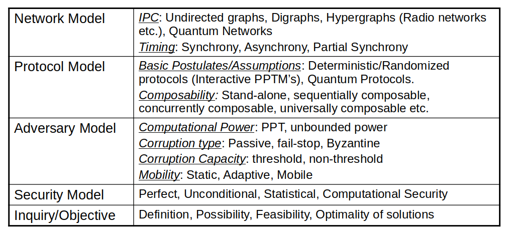

## Algorithms Analysis and Design

#### Week 13  - Diary 

#### Ayan Agrawal (2020101034)

### Lecture 19 : Byzantine Agreement 

### Problems for the class :

- Byzantine Agreement
- Authenticated Byzantine Agreement
- Connectivity and Round complexity challenge

### Byzantine Agreement

- The big picture here is the motive of agreement to simulate a broadcast channel in a **P2P** network. It is used in distributed computing.
- This image can be created by recalling a historical event where *Byzantine Army* was organized into divisions, each headed by a General who possessed traits like:
  - Each General is either a loyalist or a renegade to the Byzantine state.
  2. All Generals communicate by sending and receiving communications.
  3. There are only two orders: **onslaught** and **withdrawal**.
  4. All loyal Generals should follow the same combat or evacuation strategy.
  5. The protocol should not fail if there is a small linear fraction of bad Generals (less than 1/3).

- The problem is typically rebuilt as a General In-charge and loyal Lieutenants, with the General being either loyal or disloyal, and the Lieutenants possessing the following traits :
  - All faithful Lieutenants carry out the exact same instruction.
  2. All loyal Lieutenants will carry out the orders of the commanding General if he is reliable.
  3. Only approximately a third of all people are traitors, including the General in-charge.

*Now, Lets see the procedure used in this agreement with respect to our field :*

- Each process begins with an input from the fixed set $V = \{0,1\}$.
- The goal is for the players to eventually create decisions from the set $V$ that match the following conditions, even in the face of an enemy who can Byzantinely corrupt up to any $t$ of the $n$ players.
  1.  **Agreement:** All non-erroneous processes decide on the same value $u \in V$. 
  2. **Validity:** If all non-erroneous processes start with the same initial value $u \in V$, then $u=v.$
  3. **Termination:** All non-erroneous processes eventually decide.

- Following are some models : 

  ​		

#### In case of 1 traitor in 3 

Generals $A, B$, and $C$ are the three generals to consider. If $C$ is faithful and receives two contradictory signals from $A$ and $B$, he will be unable to determine which message is correct and who is the traitor.

As a result, the problem is unsolvable. We can incorporate extra protocols to make it hard for the traitor to transmit fake messages, such as requiring a legitimate message for the notification to prevent it from being falsified.

#### In case of 1 traitor in 4 

Consider the following four generals: $A, B, C$ and $D$. $A$ is a trustworthy person. In such a case, the process is for all generals to first receive the directive they received from the commander, and then to communicate the given information to one another. Now $A$ will tabulate the responses he received from the other generals, noticing that just one row and column contain contradictory messages, making it simple to identify the rogue. *Protocol exists as a result.*

**Message Matrix :** 

From the protocol for 1 out of 4, we construct the following $4*4$ matrix:

​													$\begin{bmatrix}V_{11}&V_{12}&V_{13}&V_{14}\\V_{22}&V_{22}&V_{23}&V_{24}\\V_{31}&V_{32}&V_{33}&V_{34}\\V_{41}&V_{42}&V_{43}&V_{44}\end{bmatrix}$

here, $V_{ij}$ is the message player $i$ says he recieved from player $j$. The message matrices differ across players by at most one row & corresponding column.

### Authenticated Byzantine Agreement

- **Pease et al.** proposed the Byzantine Agreement problem 30 years ago, in which nodes must maintain a consistent picture of the world despite the challenge given by Byzantine defects.
- So, it is popularly known that Byzantine Agreement is achievable across a perfectly linked synchronous network of $n$ nodes tolerating upto $t$ faults iff $t < n/3$.  

- **Pease et al.** gave the nodes the ability to authenticate themselves and their messages, proving that agreement in this new model (aka **Authenticated Byzantine agreement ,ABA**) is possible iff $t < n$. (which is a huge improvement over the bound of $t < n/3$ for the same functionality in the absence of authentication).

#### ABA Protocol for 1 out of 3

- $W_{ik}$, for all $i \in P$ is maintained by player $k$. Initially, $W_{kk}= {σ}$, where $σ$ is the input value of player $k$. 

- Repeat the following steps for a total of two rounds:

  - Take values from your neighbors and do the following for each
    one: 

    - He appends the message's content to the set $W_{ik}$ if
      it is correctly signed.

    - To his neighbors, he sends $i$,$W_{ik}$.

      

- He removes $W_{ik}$ if $|W_{ik}| ≠ 1$ from the equation.

- Since all remaining $W_{ik}$'s are singleton, he takes majority over all  values. If a majority exists he decides on it, else decides on the default value.

### Connectivity and Round Complexity Challenge

#### 1. Connectivity challenge :

Consensus is possible only if the network is $(2t + 1)$-connected in a (synchronous) **P2P** network with $n$ nodes, $t$ of which are (Byzantine) defective. When it comes to cryptography, $(t + 1)$-connection suffices.

#### 2. Round Complexity challenge :

In a (synchronous) **P2P** network of $n$ nodes, $t$ of which are (fail-stop / Byzantine) faulty, consensus requires $> t$ rounds, in the worst case.

OTHER METHODS FOR CONSENSUS : 

- Blockchain based Proof-of-work
- Proof-of-stake
- Quantum Byzantine Agreement