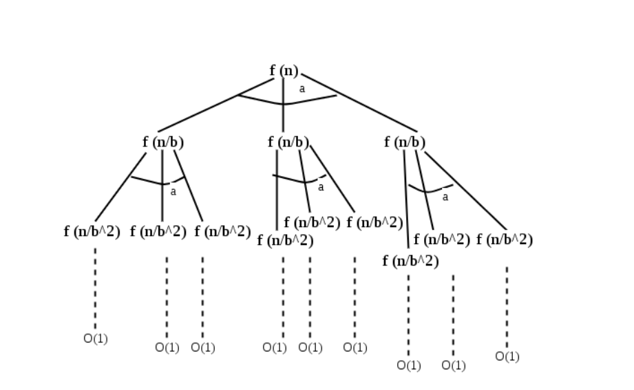
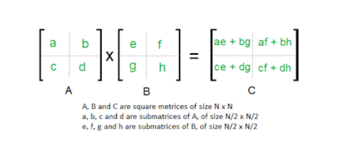
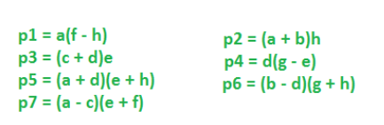
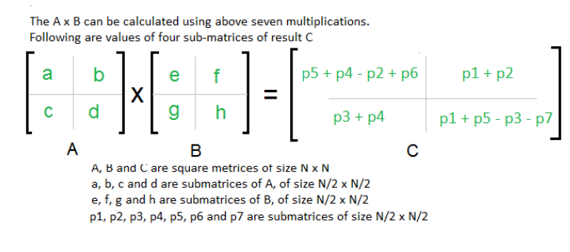

## Algorithms Analysis and Design

#### Week 2 - Diary


#### Ayan Agrawal (2020101034)

### Lecture 4 : Divide and Conquer

- In this lecture, we first discussed about Master theorem for recurrence relations.

##### 1. Master Theorem 

- This theorem is used to solve the recurrence relations, which are as

  ​								$T(n) = aT([\frac{n}{b}]) + O(n^d)$ ,

  $\text{ where a } \in \R, \text{ b and d are real constants such that } a \geq 1, b \geq 1 \text{ and } d \geq 0$ 

- It helps us to find out the time complexity of an algorithm, when we have the recurrence relation for it. It shows us how we divide the problem into a sub-problem and then use algorithm itself to solve the problem.


##### 	$$Theorem :$$  

​				$\text{ For recurrence relations of the above given form, }$

​								$\begin{equation} f(x) =\begin{cases}  O(n^d), \text{ if } d > \log_ba \\ O(n^d \log n), \text{ if } d = \log_ba \\ O(n^{\log_ba}), \text{ if } d < \log_ba \end{cases}\end{equation}$ 

​				

​				With the help of below given tree structure's figure, we will try to prove the theorem.

​				  

​				

​				Recurrence relation for the above given tree can be written as follows :-

​									$$T(n) = n^d + a(n/b)^d + a^2(n/b^2)^d + ......a^l(n/b^l)^d$$ 

​									$$\text{Here, } l = \text{ number of levels in recursion}$$ 

​									$$\text{Therefore, } l = \log_b{n}$$ 

​				Doing further simplification in recurrence relation, we get

​									$$T(n) = n^d[1 + a(1/b)^d + a^2(1/b^2)^d + ......a^l(1/b^l)^d]$$ 

​				This is nothing but a geometric series with common ratio :

​															$$ r = a(1/b^d)$$ 

​				

​	We'll form different cases for values of $$r$$ :

   1. $$r<1$$ : Infront of 1, big powers of $$r(<1)$$ would be neglected. So, complexity is $$O(n^d)$$.

   2. $$r=1$$ : all $$O(logn)$$ terms would be equal to $$O(n^d)$$.

   3. $$r>1$$ : Last term would be dominating here as series is increasing, so complexity : 

      ​													$$n^d*(\frac{a}{b^d})^l = n^{\log_b{a}}$$ (on solving)


> This is how Master theorem can be used to calculate time complexities quickly without the pain of solving the whole recurrence relation.

##### 2. Merge Sort

- Merge sort is a sorting algorithm technique which uses the Divide and conquer algorithmic technique to sort the elements.

  - The algorithm is as follows : ***We firstly divide the given in two arrays of equal size, recursively sort the two arrays using merge_sort() function and then merge the two sorted sub-arrays.***

    ```python
    function merge(x[1,....,k],y[1,....,l]):
        if k == 0 : return y[1,....,l]
        if l == 0 : return x[1,....,k]
        
        if x[1] <=y[1]:
            return x[1].merge(x[2,....,k],y[1,....,l])
        else:
            return y[1].merge(x[1,....,k],y[2,....,l])
    ```

    

- Merge sort can also be implemented using a queue, which will be in an iterative manner.

  - Initially, all the elements are inserted into the queue but actually we treat them as n individual arrays, then we take elements from arrays in pair and then merge them and push the resulting array to the back of the queue and repeat this until we just have a single element(array) in our queue.

    ```python
    function iterative_mergesort(a[1,....,n]):
    #input : elements a_1,a_2,...a_n to be sorted
    	Q = [] # empty queue
        for i=1 to n:
            inject(Q,[a_i])
        while |Q| > 1:
            inject(Q,merge(eject(Q),eject(Q)))
        return eject(Q)
    ```

    

- This merge procedure does a constant amount of work per recursive call  ($$O(k+l)$$ calls in total).

- Merge function is linear time.

- Overall time complexity : 

  ​													$$T(n) = 2T(n/2) + O(n)$$

  ​													which is equal to $$O(nlogn)$$ (by Master Theorem)


##### 		2.1 Lower Bound for comparison based sorting :

- $$nlogn$$ is the lower bound for comparison based sorting. This can be proved by observing only out of $$n!$$ permutations of sequences is sorted. Suppose there are $$k$$ comparisons, so we would need atleast $$n!$$ comparisons for differentiating between these permutations. Therefore,

  ​													$$2^k > n!$$ should be satisfied, which means $$k > log(n!)$$

  ​													Also, $$log(n!) < log(n^n) < nlogn$$ is true.

  ​													

  Thus, lower bound for comparison sorting is $$nlogn$$. 


##### 3. Matrix Multiplication

- Matrix multiplication by naive algorithm would be time consuming as would be of the order of $$n^3$$. But, we are discussing this problem in Divide and Conquer method so definitely we could do better by that algorithm technique using Strassen algorithm.


**3.1 Strassen Algorithm** 

​		Assuming two $$2 \cross 2 $$ matrices, we would be needing 8 multiplication operations,

​						 

- We would be focussing on reducing the expensive multiplication operation here rather than in-expensive addition operation. Here, above matrices can be multiplied with only 7 multiplication operations. Given below $$p_i, i \in [1,7]$$ are the 7 products to be performed.

  ​	 

  

  So, only 7 multiplication operations are required. Recurrence relation would be :

  ​													$$T(n) = 7.T(n/2) + O(n^2)$$ 

  Using master theorem, we get complexity as 

  ​													$$O(n^{log7}) = O(n^{2.81}) < O(n^3) \space [as \log_2{7} > 2]$$ 


- This is better than naive algorithm but still we have no confirmation whether best algorithm currently is most optimal or not. Though, best known complexity is $$O(n^{2.37})$$. 


##### 4. Median of unsorted array 

- Median can be calculated by sorting fastest in $$O(nlogn)$$ and then finding $$(n/2)^{th}$$ element from the sorted array in $$O(1)$$. But, this is naive solution, we can do much better by using Divide and Conquer technique.


Algorithm for better complexity is :

1. Divide the given array of $$n$$ elements into groups of $$[n/5]$$ elements and then sort each of those groups in constant time in order to find median of each of those 5 groups and store them in another array.

2. Find median of each of these sub-arrays by recursion and use them as pivot.

3. Now, setting a pivot, assume three sets as $$S_L$$, $$S_V$$ and $$S_R$$ where $$S_L$$ has elements less than pivot, $$S_V$$ has elements equal to pivot and $$S_R$$ has elements greater than pivot.

   if we want to find $$k^{th}$$ smallest element in an array, so there would be three cases possible : 

   ```function select_element(k,S) :```

   - if $$k < |S_L|$$ , then select_element($$k^{th}$$ ,$$S_L$$).
   - if $$k > |S_L| \space \& \& \space k \leq |S_L| + |S_V|$$, then return $$v$$. 
   - $$k > |S_L| + |S_V|$$ , select_element$$((k - |S_L| - |S_V|)$$, $$S_R)$$. 

   We will recursively call this function with median as pivot and median to get the median of the array.

   **4.1 Time complexity**

   - Finding pivot of $$[n/5]$$ elements would take $$T(n/5)$$ time by recursion, $$O(n)$$ to traverse through a array and determine $$S_L,S_V,S_R$$ .

   - Now, we know at least half of the medians found in step 1 of our algorithm described above would be greater than or equal to the pivot . So at least half of the $$[n/5]$$  groups would have elements which are greater than pivot
     and therefore number of elements greater than pivot would be around

     ​											$$m = \frac{3n}{10} - 6$$

     Similar argument would give number of elements less than pivot.

     Therefore, we need to recurse through only $$n-m$$ elements in the recurse function. Recurrence relation would be : 

     ​											$$T(n) = T(n/5) + T((7n+60)/10) + O(n)$$ 


- Assuming complexity is around $$c.n$$ , we can show that algorithm works at $$O(n)$$ for higher $$n$$ and smaller $$n$$ , we can use naive algorithm. 

