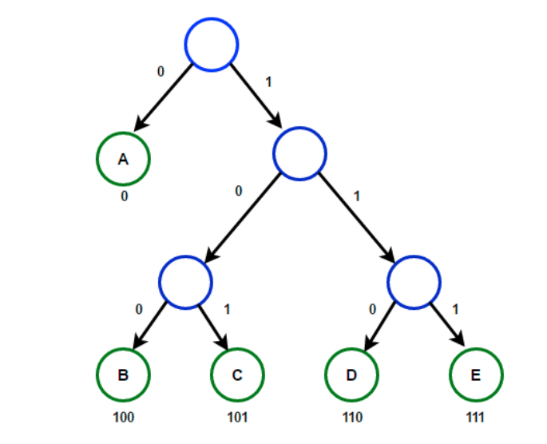

## Algorithms Analysis and Design

#### Week 4  - Diary 

###### (Only 1 lecture in this week due to quiz week.)


#### Ayan Agrawal (2020101034)


### Lecture 7 : Activity and Huffmann

#### Problems for the class :

- Greedy choice property and Optimum sub-structure property.
- Challenge of Activity Selection and how it can be solved using the greedy
  strategy.
- Huffmann codes
- Intro to Entropy in information theory.


#### Greedy choice property and Optimum sub-structure property :

- Greedy choice of a problem is nothing but a question that *Is it possible to take first step towards an optimal solution.* 
- If we get such step for the given problem, we move towards our next step which is Optimal sub-structure property which involves reframing the problem into a smaller version, by induction we are bound to get a solution.

We have some problems using Greedy approach, now we'll see Activity selection problem.

#### Activity Selection Problem : 

- Here, in this problem, we are given a set of $$n$$ activities , each having start and finish time. 
- We are expected to select maximum number of activities such that they can be performed single-handedly or basically they cannot overlap such that there is no 2 activities at the same time. 

Let's see the solutions possible for this task.


##### Brute force solution :

- One basic solution to the problem is checking all possible subsets from the given set of activities. As activity set size is $$n$$, we need to check $$2^n$$ subsets and check the above mentioned property for each of them. Then, we will find the maximum length subset that also satisfies property mentioned above. 
- This is definitely a very time-consuming affair. Now question is *Can we do better?* 

Yes, We could use greedy approach here to do better. 

##### Greedy Solution : 

- We will try thinking here with a greedy mind, but we will start according to the approach of 2 steps mentioned above. Lets start with greedy choice, 

1. **Greedy choice :** The basic obervation here is that activity with minimum finish time is definitely a part of the optimal solution.


##### 	 	Proof : 

- Lets suppose activity with least finish time is $$a_0$$ and current optimal solution is $$S$$. If $$a_0$$ is present in $$S$$ then we don't need to prove anything. If $$a_0$$ is not part of $$S$$ then consider $$a_k, k \in [0,n-1]$$ in $$S$$ which has minimum finish time.
- We can see here that we can replace $$a_k$$ by $$a_0$$ since $$a_0$$ is the global minimum and $$a_k$$ is only the local minimum. As finish time of $$a_k >=$$ finish time of $$a_0$$ , we can put it in solution and observe it does not affect the number of elements in our optimal solution.

2. **Optimal Substructure :** Now, after one step taken, we can reduce the problem to a smaller version. All those activities which are non-compatible to $$a_0$$ can be removed from the set, i.e., all those activities whose time frame is not disjoint with $$a_0$$. 

   This algorithm can now be used on remaining elements by picking up activity with least finish time and removing non-compatible elements. This can be done until set is non-empty.

   

   **Pseudo Code :- ** 

   ```python
   // Assuming set as 0 indexed
   sort([a_0,....a_{n-1}]) // according to finish time of activities
   set p = 0; // point on least finish time activity a_0
   for q = 1 to n-1:
       if start time of q >= finish time of p:
           print a_q
           set p = q
   ```

   The procedure seen above is a linear procedure, but the sorting of the pairs would take some extra time and thus the complexity would finally be $$O(nlogn) .$$ 

   

#### Huffmann Codes :

- Huffmann coding is a method to solve problem of finding the most economical way to write a given long string in binary.

- **Problem statement :** *We need to find minimum number of bits to represent the string, Given us few characters and their respective frequency in an input string.* 


1. **Naive method :** Say we have 4 letters $$\{ A, B, C, D\} $$. The most easy way would be to assign 2 bits for each 4 letters, Suppose $$ A = \{0,0\}$$, $$ B = \{0,1\}$$, $$ C = \{1,0\}$$, $$ D = \{1,1\}$$. Let's have frequency of each letter as :

   $$ A = 70 \space million$$ 

   $$ B = 3 \space million$$

   $$ C = 20 \space million$$

   $$ D = 37 \space million$$ 

   With this data, we would take $$ ((70+3+20+37)*2) \space million \space bits$$. 

   Can we use better schema and lesser space? Turns out YES, we can. We use a property of variable length encoding for the Huffman coding to do better in this problem's solution.

##### Huffmann coding : 

- In huffmann coding, we assign variable length codes for input characters and those lengths are dependent on frequency of the character. 

- But we can't just randomly assign the codes , we will need to make sure that no
  codeword is a prefix of another codeword. This is because we would also need to get back the original string from the binary representation.

  Basically, our codes would be represented in the form of a tree called Hufmann tree whose leaf nodes would be the codewords and tree would be complete binary tree (since if it is not, we can remove the node with one child and that will ensure a better answer). This is known as **Prefix-free property.** This method is known to reduce cost of tree in above example to $$213 \space megabits$$ which is about $$17\%$$ improvement.


​					 

​		We need to calculate cost of a tree : $$\text{ Cost of tree } = \sum_{1}^{n} freq[i]*depth[i].$$ 

​		Let's do this greedily.


##### Greedy choice : 

- The greedy choice in this problem would be to first select the two symbols with
  smallest frequency as the bottom of the tree, observing the formula for the cost of the tree, we would like to keep frequency at most depth less.

##### Optimal substructure : 

- Once 2 leaf with min. freq is taken, we can remove both of them, add their frequencies and add this new node to our tree. Keep repeating same procedure.
- So, the substructure is that the cost of a tree with frequencies of $$n$$ leaves being $$freq[i] , i \in [0,n-1]$$ is equal to cost of tree with $$n-1$$ leaves being $$(freq[0] + freq[1]), freq[2], ...so \space on.$$ Therefore, Cost of tree is sum of all frequencies of leaves and internal nodes except the root.

**Algorithm :** 

1. Create a min heap and insert frequencies of $$n$$ leaf nodes. 
2. Get 2 min freq nodes from min heap and create a new internal node with frequency equal to sum of frequencies of 2 extracted nodes and add new node to the min heap.
3. The first extracted node if left child and other is right child.
4. Repeat step 2,3 until min heap size becomes 1.

```python
function Huffmann(c) :
    for i=1 to n:
        n = node(c[i])
        Q.push(n)
    end for
    while Q.size() != 1:
        Z = new_node()
        X.left = x = Q.pop()
        Z.right = y = Q.pop()
        Z.freq = x.freq + y.freq
        Q.push(Z)
    end while
    return Q
```

- $$\text{ Time complexity of this algorithm } = O(nlogn)$$ [ iteration through $$n$$ nodes and deletion from min heap is $$O(logn)$$ ]. 


#### Entropy : 

- Entropy is generally defined as the randomness of a system. In information theory also, it has similar kind of meaning. Here, It refers to the *Minimum number of bits required to encode single draw from a distribution.* Suppose there are $$n$$​ possible outcomes, with probabilities $$p_1 , p_2 , ....p_n$$ . A general question would be, for a draw of $$m$$ values, what is the number of bits required to encode the $$m$$ sequence of values. This is given by : 

  ​											$$\sum_{i = 1}^{n} m*p_i*(\log(1/p_i))$$ 

  For $$m = 1$$ , it is defined as entropy of distribution, 

  ​											$$\sum_{i = 1}^{n} p_i*(\log(1/p_i))$$ 

  ​									or    $$\sum_{i = 1}^{n} -1*p_i*(\log(p_i))$$ 

  Here, $$log(p_i)$$ denotes the depth of that random variable in the binary tree. Hence the concept of entropy allows us to understand how many questions or bits we would need to ask on average to extract any information .