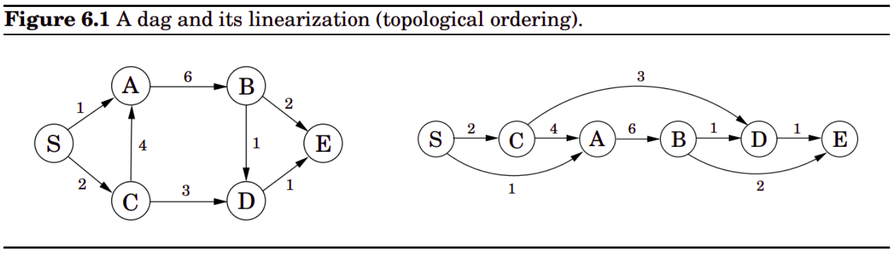
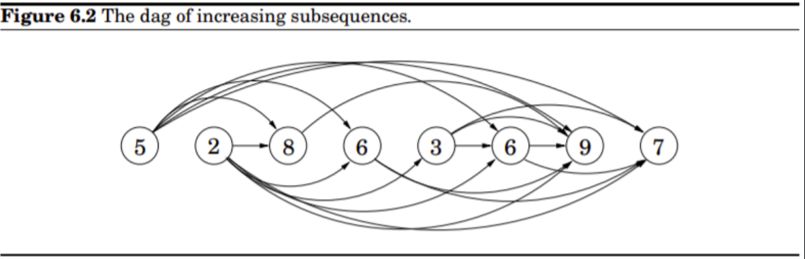

## Algorithms Analysis and Design

#### Week 5  - Diary 


#### Ayan Agrawal (2020101034)


### Lecture 9 : Dynamic Programming Paths in DAGs

#### Problems for the class :

- Idea about Dynamic Programming
- A Dynamic programming problem can be viewed as a Directed Acyclic Graphs (DAG) of its sub problems.
- Shortest and Longest path in a DAG.
- Longest increasing subsequence.

#### 1. Dynamic Programming

- In this lecture, we discussed about yet another very famous and used topic of Dynamic Programming. Dynamic programming is a technique that is widely used in problems that have the **Overlapping sub-problems property and the Optimal substructure property**. 

- It uses the fact that the answer to a particular state is always determined by some previously calculated state, and thus we store the answer for every state on computing, to use it later on without having to calculate it again.

#### 2. Dynamic programming as a DAG

- DAG is a graph with set of nodes that are connected via edges that start at one node and end at another.
- They have a fixed direction for iterating through the nodes, i.e, a node can't be covered again by coming in reverse direction, moreover the graph does not contain cycles as well.
- We can view any dynamic programming problem as a DAG if we take all the sub problems to be solved as the nodes of the graph and the transition from one sub problem to another problem as the edge, it cannot be cyclic as to solve a problem say Q, we might want to know the solution/outcome to problem P which is also a sub problem, and thus we have a relative ordering of sub problems/nodes here.

#### 3. Shortest/ Longest path in a DAG

We must find the shortest path between two vertices in a directed acyclic graph i.e a graph with directed edges and no cycles.

 `Input`:  A directed acyclic graph, source node S and ending node E. 

`Output`: Shortest path from node S to E.

#### Algorithm 

- The special feature of a DAG is that its nodes can be **topologically sorted** meaning that we arrange the vertices in a lines such that the edges are pointing forward, never an edge that is directed backward. When we have a topological ordering, we can see that there is an order that exists in which we can solve the subproblems without any issues. 


```python
dist[] -> infinity  // initialise distance to all nodes to infinity
dist[s] = 0         // s is source node
for v in V\{s} :
    dist[v] = min{dist[u]+edgeweight(u,v)} [for all (u,v) belongs to E]
```

 

- Notice that if we define a recursive formula , we can see that there is very frequent overlapping in subproblems which hints at the fact that we can use dynamic programming. 

- Since in our algorithm we have topological order of nodes for finding the minimum distance from $s$ to $v$ called $dist(v)$, we’ll go over all edges that go from some vertex $u$ to $v$. For each edge in this set, find the minimum of $dist(u) + l(u, v)$. We might have to use the value of $dist(u)$ multiple times, therefore we store the value when we compute so that we don’t have to calculate it multiple times. 

#### Dry run of Example taken in lecture

 


* $$dist(S) = 0$$ 

* $$dist(C) = min(dist(S) + l(S, C) = 2$$  

* $$dist(A) = min(dist(S) + l(S, A), dist(C) + l(C, A))  = 1$$ 

* $$dist(B) = min(dist(A) + l(A, B)) = 7$$ 

* $$dist(D) = min(dist(C) + l(C, D), dist(B) + l(B, D))  = 5$$ 

* $$dist(E) = min(dist(D) + l(D, E), dist(B) + l(B, E)) = 6$$ 

  

  #### Longest path in a DAG 

   Finding a longest path in a DAG is extremely easy now that we know how to find shortest path in DAG using DP. We can just do the same thing we did in shortest path, do a topological sort and **instead of finding minimum of the distance we find maximum possible distance** while solving the subproblem. Though longest path in a general graph is a much more tougher problem and is in fact NP hard. 

  

#### 4. Longest Increasing subsequence

A subsequence of a given sequence is a sequence that can be derived from the given sequence by deleting some or no elements without changing the order of the remaining elements.

`Input`: A sequence of numbers $$a_1, a_2, \cdots , a_n$$ 

`Output` : A maximum possible length subsequence which is strictly increasing.


#### Algorithm

We will first try to express the problem as a DAG of the subproblems. Lets try to build the DAG on this rule: Let all the elements of the sequence be the nodes of the graph. Lets then try adding edges between node $i$ and $j$ iff $i < j$ and $a_i < a_j$ . The DAG for a sequence of $\{5, 2, 8, 6, 3, 6, 9, 7\}$ would be something like this :





- We will try to compute the longest increasing subsequence ending at every node, the answer would thus be the maximum of all the subsequences ending at node $i$ from $1$ to (length of that sequence). The toposorted order in this case would just be the order of the elements in the sequence given.

- To formalise the algorithm, we can say that an LIS that ends at a node $i$ can be represented as $$dp[i]$$ and the answer of $$dp[i]$$ would be $1$ plus $$max(dp[i]) \text{ such that } j < i \text{ and } a_j < a_i$$ . 

- After getting $dp[i]$ for all $i$ from $1$ to (length of that sequence). The LIS would be the maximum of all $$dp[i]$$ . 	

  Let $dp[i]$ represent the length of the longest path or increasing subsequence ending at $$i^{th}$$ node.

##### Code 

```c++
int lis(vector<int> const &a) 
{
	int n = a.size();
	vector<int> dp(n, 1);
	for (int i = 0; i < n; i++) 
    {
		for (int j = 0; j < i; j++) 
        {
			if (a[j] < a[i])
			dp[i] = max(dp[i], dp[j] + 1);
		}
	}
	int ans = dp[0];
	for (int i = 1; i < n; i++)
    {
	ans = max(ans, dp[i]);
	}
	return ans;
}
```


