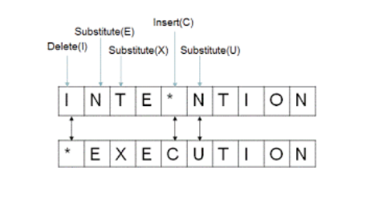

## Algorithms Analysis and Design

#### Week 6  - Diary 


#### Ayan Agrawal (2020101034)


### Lecture 10 : Edit Distance 

### Problems for the class :

We discussed more about Dynamic Programming and tried to expand our understanding to solve the **"Edit Distance"** Problem.


#### Edit Distance

##### ***Problem :***

-  Given two strings $$A$$ and $B$ , we need to find the minimum number of insert, delete or replace operations in order to convert $A$ to $B$. 
- It is equivalent to asking the extent to which these two strings align or match.

##### Example :

Assume $A = INTENTION$ and $B = EXECUTION$



- We can delete the 1st $I$ , substitute $N$ , $T$ and so on and we can observe that we can convert the string $A$ into $B$ using a minimum of $5$ operations.

More ways are possible but this one has least number of operations.

Let's have a look on how to solve this :

#### DP solution : 

First, Lets check the sub-problem property and sub-structure property here.

**1. Sub-problem property** 

We can very easily define a sub-problem for the given problem at hand.

- Say the length of string $A$ is $n$ and that of $B$ is $m$ , then we can ask a problem like what are the minimum number of delete, insert and replace operations to convert come prefix of $A$ say $A[i]$ (prefix of first $i$ letters of $A$ ) and similarly $B$ say $B[j]$ (prefix of first $j$ letters of $B$) .

**2. Sub-structure property** 

Since we have already defined the sub - problem , we have following options for each $$i,j$$.

- Delete a character from the string.

- Insert a character into string.

- Substitute one character into another .
  	

  Now, Lets see the algorithm involved here,

  So, Let's consider $dp[i][j]$ as the minimum number of operations that we have to perform to convert the prefix of first $i$ character of $A$ into the prefix of first $j$ character of $B$.


1. When $$A[i] == B[j]$$, we don't need to perform any of those of operations so 

   ​											$$dp[i][j] = dp[i-1][j-1]$$ 

2. When they don't match, 

   - If we are inserting a character in $A$, then

     ​							$$dp[i][j] = 1 + dp[m][n-1]$$

   - If we remove a character from $A$, then

     ​							$$dp[i][j] = 1+ dp[i-1][j]$$

   - If we replace a character in A, then

     ​							$$dp[i][j] = 1+ dp[i-1][j-1]$$ 

   ​	

   Therefore, To calculate $$dp[i][j]$$, we need to take minima of the above mentioned 3 options.

   

   ##### Pseudo code :

   ```python
   for i in (0,1,....m):
       dp[i][0] = i
   for j in (0,1,....n):
       dp[j][0] = j
   for i in (1,2,....m):
       for j in (1,2,....n):
           dp[i][j] = min{(1 + dp[i-1][j]),(1 + dp[i][j-1]),(dp[i-1][j-1] + check(i,j))}
   
   return dp[m][n]
   ```

   ​						

   ​									