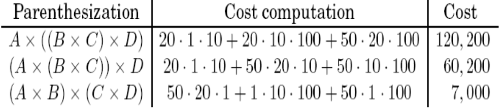
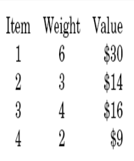

## Algorithms Analysis and Design

#### Week 6  - Diary 


#### Ayan Agrawal (2020101034)


### Lecture 11 : Chain matrix multiplication & Knapsack

#### Problems for the class :

We continued with Dynamic Programming and solved the problem of **Chain Matrix Multiplication** using it. We also looked at a very famous problem called **Knapsack**.

### 1. Chain Matrix Multiplication:

In this problem we are given a chain of matrices which we must multiply in the given order ( because matrix multiplication is only associative and not commutative)  and our task will be to minimise the number of computations.

Let us understand the cost of multiplying two matrices say $A[n,m]$ and $B[m,o]$ . So the resultant matrix will have $n*o$ elements and to calculate each cell of the resultant matrix , we would need to perform m multiplications. Hence the total cost of computation would be $n*m*o$.

Now since matrix multiplication is associative, we know there can be various ways of multiplying a chain of matrix .

For example: $$A[50 \cross 20] , B[20 \cross 1], C[1 \cross 10] \text{ and } D[10 \cross 100]$$. 

Let us look at 3 possible multiplication orders, and compare the costs (in terms of number of computations required) :





Hence out of all possible ways to multiply the given matrices, we need to choose the one with the minimum number of computations.

#### Dynamic Programming Approach :

- For the dynamic programming solution , we must have optimal substructure property as well as the overlapping problems property .


- Hence let $dp[i][j]$ denote the minimum cost of multiplying matrices from $i$ to $j$. To get $dp[i][j]$ , we can iterate through all possible ways of multiplying that is multiply the first matrix with the remaining matrices, multiply first 2 matrix with remaining matrix and so on.

We can thus iterate over all $k$ and find the minimum cost for each $k$ and the partition that is formed. We notice that to compute $dp[i][j]$ we need $dp[i][k]$ and $dp[k + 1][j]$ thus telling us that we need to implement the algorithm in a bottom up fashion. We can also first initialise $dp[i][i]$ to 0 as its just one matrix. Our final answer would be stored in $dp[1][n]$ which denotes the minimum cost to multiply matrices from index $1$ to $n$ that is all given matrices.

So we can observe we have the optimal substructure property in our array.

Say $A$ and $B$ have index $i$ and $j$ with dimensions $n*m$  and $m*o$ .

$dp[i][j]=min(dp[i][k]+dp[k+1][j]+m_{i-1}*m_k*m_j)\space  ∀ \space i \leq k<j$ 

Base Case: $dp[0][0]=0$ since there is zero cost in case of single matrix.

```python
for i = 1 to n: 
    dp[i][i] = 0
for s = 1 to n-1:
	for i = 1 to (n-s):
		j = i + s
		for  k = i to j:
			dp[i][j] = min(dp[i][k]+dp[k+1][j]+m[i-1]*m[k]*m[j])
return dp[1][n]
```

The $m$ array contains row of $i^{th}$ matrix in $m[i − 1]$ and column in $m[i]$ . As the column and row of adjacent matrices have to be equal.

#### Time Complexity:

We can see that we can do a $2D$ DP and to find the value of each cell of that DP, we would need to iterate through all the elements in the range from $i$ to $j$.

So there are $n*n$ dp states and for each state , we need $O(n)$ time to calculate it resulting in the final complexity of  $O(n^3)$.

### Knapsack Problem:

- Here, we are given a knapsack of say capacity $W$ which denotes the total weight of the items the knapsack can hold. Also, we are given $n$ weights $w_1, w_2,...., w_n$ with corresponding values $v_1,v_2,....., v_n$. 
  Let's see an example

  

  ​																			**$W = 10$**

-  We need to pick a subsets of items from the given items so that the total weight of items $ \leq W$ while the total value is maximum. Hence we need to maximize value given some constraint of the total weight.

- There are 2 variations for the same question, 

  - Where we can take a particular item multiple times, this is called **Repetitive knapsack or Unbounded knapsack** 

    Optimal solution for above example :

    ​		`Item1 + 2*Item4 = $30 + 2* $9 = $48 `

  - The other case is where an item can be taken only once, this is called **0/1 knapsack or Bounded knapsack.**

    Optimal solution for above example :

    ​		`Item1 + Item3 = $30 + $16 = $46 `

  We'll see both these variations one-by-one and try to solve them.


#### Unbounded or Repetitive Knapsack :

- We would have a DP solution here. Let's denote the maximum value that a sack of max capacity $i$ can hold is $dp[i]$ . Then for a sack of weight $W$, the
  maximum value that we can achieve is $dp[W]$ . Thus we can just iterate over all items and check which is feasible to take. To formalise :

  ​					$dp[W] = max(dp[W - W_i] + v_i) \space \forall \space i : W_i < W$ 

  So, we would iterate over all values in the vector for all weights ranging from $$1$$ to $$W$$. 

  ```python
  dp[0] = 0
  for i = 1 to W:
      for j = 0 to n:
          if(w[j] <= i):
              dp[i] = max(dp[i - w[j]] + v[j], dp[i])
  return dp[W]
  ```

**Time complexity :** $$O(nW)$$ as it fills a 1-D table of length $$W+1$$ in L-to-R order.

#### Bounded or 0/1 Knapsack :

- Let's denote the maximum value obtained by taking only the first $j$ items and weight $W$ by $dp[w][j]$.We can therefore say that either the $j^{th}$ item is required or can be discarded to get the maximum value. Thus our transition would be as follows :

  ​					$$dp[W][j] = max(dp[W − W_j ][j − 1] + v_j , dp[W][j − 1])$$

  ```python
  for j = 1 to n:
      for w = 1 to W:
          if(w_j > w):
              dp[w][j]=dp[w][j-1]
  		else: 
              dp[w][j]=max(dp[w][j-1],dp[w-w_j][j-1]+v_j)
  return dp[w][n]
  ```

**Time complexity :** $O(nW)$ as we need to fill 2-D table of size $nW$ and each entry takes $O(1)$ to fill.


### Food for thought: (Extra Reading)

#### Printing the Brackets in CMM problem:

In class, we discussed how to find the minimum cost of multiplying matrices but it is not something which is very useful.

The more realistic problem should be to print the optimal bracket sequence for multiplying the matrices. 

#### Algorithm:

- For each $dp[i][j]$ we can also store the break point of that transition ,i.e,  such that if we break at $k$ , we get minimum cost and $k$ is the break point.
- So we can maintain a parent array along with DP array of same dimensions and answer this problem.
- Now make a recursive function and call the function until $i==j$ at which we can just print it directly.
- If $i!=j$ we can first print the sequence for the left sub problem,i.e.,  from $i$ to $k$ and then for the right sub problem that is from $k+1$ to $j$.


```cpp
void print_bracket(int i,int j,vector<vector<int>> &brackets, char &cur_name)
{
    if(i == j)
    {
        cout<<cur_name;
        cur_name++;
    } 
    else 
    {
        cout<<"(";
        // Reduce the problem into left sub-problem
        print_bracket(i, brackets[i][j], brackets, cur_name);
        // Reduce the problem into right sub-problem
        print_bracket(brackets[i][j]+1, j, brackets, cur_name);
        cout<<")";
    }
}
```

