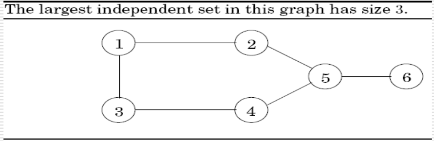
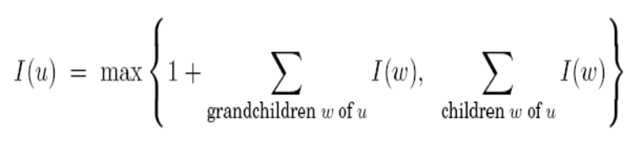

## Algorithms Analysis and Design

#### Week 7  - Diary 


#### Ayan Agrawal (2020101034)


### Lecture 12 : More DP Examples

#### Problems for the class :

- Shortest Reliable Path problem
- Floyd Warshall
- Independent Set


### Shortest Reliable Path Problem :

- We're given a graph $G$ with say $n$ nodes and $m$ edge lengths, two nodes namely start node $s$ and destination node $t$, and an integer k, and we're asked to find the shortest path from $s$ to $t$ that uses at most $k$ edges.
- Now, we know that Dijkstra's Algorithm gives us the shortest path but here, we are interested to find the shortest path with the least number of edges such that the number of edges is atmost $k$. 
- This is a real life application because say For example , we not only need to find the shortest path for delivering the packet but also the number of edges should be minimal as packet dropping chances increase with each passing by edge.
- To solve this problem, we cant use a greedy method because clearly the greedy choice property does not hold. So we turn to Dynamic programming because the Optimum Substructure Property still holds.


#### Dynamic Programming approach:

##### 			Identifying sub-problem: 

- Considering $$dist[i][j]$$ as the shortest distance from node $$s$$ to node $$i$$, using $$j$$ edges in total.

  ​	


Here, Transition would look like :


- Here, optimal substructure property exist as a node can be reached from connecting edges and therefore calculating distance again isn't required.
- **Time complexity :** $O(k.∣E∣)$ since we have $k$ max edges that we can go through and to calculate for each $k$ , we would need to go through all the edges.


```
int dist[n][k];
dist[] = { inf. } //initialize distance to every node to infinity
dist[s][0] = 0; //base 
for i = 0 to k:
	for v in V:
		dist[v][i]=min{dist[u][i-1]+edgewgt(u,v)} for all (u,v) belong to E
int ans = min{dp[v][i]} where i lies in [1,k]
```

This algorithm is different to Bellman Ford algorithm in only way that outer loop is ran for $k$ times instead of $n-1$ times.


### Floyd Warshall Algorithm

*Given a graph G with $n$ nodes, we need to find the shortest path between all possible pairs of points.*

- Using Dijkstra here would be very expensive w.r.t time and space. So, we use this algorithm which uses DP.
- Dynamic Programming here is useful and efficient clearly, as we would be calculating the shortest path b/w 2 vertices for various pairs, but some pairs can have some common intermediate nodes, therefore we can keep track of subproblems we have solved, this would reduce the Time complexity by a considerable factor.

#### DP Approach: 

##### 		FInding Sub-problem:

In this problem we can define the subproblem $dist(i, j, k)$, which denotes the length of the shortest path from vertex $i$ to vertex $j$ using only the first $k$ nodes as intermediaries. Following recurrence relation can be used :

​                        $$dist(i,j,k) =  min\{dist(i,k,k-1) + dist(k,j,k-1), dist(i,j,k-1)\}$$ 

**Explanation for recurrence relation :** If we find shortest path using first $k-1$ nodes, then checking if going from vertex $i$ to $k$ and then to $j$ would shorten the path b/w $i$ and $j$ or not and proceed accordingly.


```python
dist[] = infinity // initialize distance to all nodes to infinity
for all (i,j) in E:
    dist(i,j,0) = l(i,j)
for k = 1 to n:
    for i = 1 to n:
        for j = 1 to n:
            dist(i,j,k) = min(dist(i,k,k-1) + dist(k,j,k-1), dist(i,j, k-1))
```


**Time complexity :**  $O(n^3)$ [ 3- nested loops ]


### Independent Set :

An independent set is basically a subset of nodes $S$ of $V$ of graph $G$ if there are no edges between them.

The problem here is that we want to find the largest independent set of a graph. It turns out that this problem is NP-hard, but it has a dynamic programming solution if the graph were a tree. 

**Example :**




This has a Independent set of size 3 since nodes $1,4,6$ doesn't have any direct edges b/w them. 


#### Dynamic Programming approach :

##### 		Finding sub-structure :

- $I[u]$ can be denoted as the size of the largest independent set of subtree having parent node at some node $u$. 

- We can see that for a leaf node, it's value will always be one since we can take that node itself.

- Let's explore others possibilities :

  - If we include the node $u$ in our set , then we can't include any  of the children of node $u$ but we can include the grandchildren(if any) of $u$.
  - If we do not include the node $u$ in our set , then we can find the value of $I[v]$ for all children ($v$ is a child of $u$) since we can include all of them as we excluded $u$ from the set.

  Therefore, we take max of both the cases.

Following is the sub-structure for this problem :



**Pseudo code :**

- To execute this algorithm ,we can do a DFS and for every node while doing DFS , we can find the value of $I[u]$ and in the end, return $I[1]$ as the answer if $1$ is the node from where we started our DFS.

**Time complexity:** $O(|V|)$ since the number of edges are of the same order as the number of vertices because we have a tree.


### Extra reading :

*Given a tree with $n$ nodes, we need to find the shortest distance b/w any 2 given nodes in a resonable time complexity.*

We won't use previously seen DP approach which would be costly here.

Instead, we can use approach where we root the trees at some vertex assume 0 and pre-calculate the distance from that root to all other nodes in $O(n)$ by DP.

Now for every query , we can find the Lowest Common Ancestor (LCA) of the given two nodes in $O(logn$) using any standard approach like binary lifting and solve the problem in a much better complexity if we know this property of a tree. 

​                                            $$dist(u,v) = dist(1,u) + dist(1,v) - dist(1,lca)$$ 

where LCA is lowest common ancestor from $u$ to $v$. 

