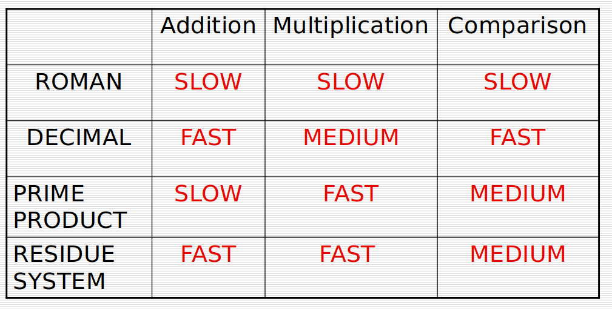
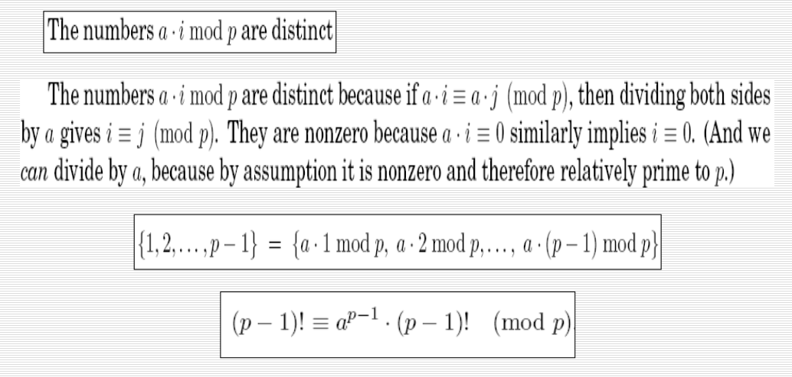

## Algorithms Analysis and Design

#### Week 8  - Diary 


#### Ayan Agrawal (2020101034)


### Lecture 13 : Number Theoretic Algorithms

#### Problems for the class :

- Euclid's Algorithm for finding GCD
- Extended Euclid's Algorithm
- Inverse modulo using GCD algorithm
- Public key Cryptography
- Fermat's Little Theorem


### Euclid's Algorithm for GCD :

By this algorithm. we can compute the GCD of 2 numbers say $a$ and $b$ in a very efficient manner. In the naive approach, we would find the prime factors of both $a$ and $b$ then we would take the common factors among both to calculate the GCD but this way takes $O(\sqrt{n})$ time which is quite costly.

The Euclid's algorithm takes just $$O(log(a))$$ time assuming $$a \geq b$$. 

```python
def GCD(a,b):
    if(!b):
        return a
	return GCD(b, a % b)
```


#### Proof for the algorithm:

**Theorem :** We know that if two numbers $a$ and $b$ have gcd $G$ , then $G$ divides both $a$ and $b$ . Now $G$ will also divide $(a − b, b)$ assuming same $a \geq b$.

**Proof:**  

Every integer that divides $a$ and $b$ (say $d$) will also divide $a-b$ since we can write $a$ and $b$ as a factor of $d$ and hence $d$ will divide $a-b$ . This would hold true for every common factor of $a$ and $b$ and hence the $gcd(a-b,b) ≥gcd(a,b)$ . 

If we apply the same argument from the other side , we would get that $gcd(a,b) ≥gcd(a- b,b)$ and hence from both these inequalities the gcd of $a,b,a-b$ have to be equal .


Now, we recursively find $a \% b$ by

$$gcd(a,b) = gcd(a-b,b) = gcd(a-2b,b) = gcd(a-3b.b)...\text{ so on till } a \% b $$ 

So, we just need to find $$gcd(b, a \%b)$$. 


##### Time Complexity :

We can observe that 

​                              $gcd(a, b) = gcd(b, a\%b) = gcd(a\%b, b\%(a\%b))$ 

We can also say $$a\%b < a/2$$. (can see this by brute forcing values of $b$)

Therefore, in every two steps we would be reducing the value of first argument of our GCD function by factor of $2$ since after two opeations we get $a \% b$.

Hence, Time complexity is $O(log(a))$. [ Because algo runs $$2*loga$$ times ].


### Extended Euclid's Algorithm :

We must first see this identity in order to sail through Extended Euclid's Algorithm.

*If $d$ divides both $a$ and $b$, and $d = ax + by$ for some integers $x$ and $y$, then necessarily $d = gcd(a, b)$*. 

#### Proof:

Since we know $d$ divides both $a$ and $b$ it is a common divisor and since $gcd(a,b)$ also divides both $a$ and $b$ it should also divide $ax + by = d$, which implies $gcd(a, b) ≤ d$. Hence, $d = gcd(a, b)$.

This algorithm also returns us these coefficients x and y. 

```python
def Extended(a,b):
    if (!b):
        return (1,0,a)
    else:
        (x',y',d) = Extended(b,a % b)
    return (y',x'-[a/b]y',d)
```

Hence it basically returns us the tuple $(x,y,d)$ in the end.

- The base case is easy to prove when $b==0$ . Now when $b$ is not equal to $0$, we know the gcd will remain same and also we can see 

  $$gcd(a, b) = gcd(b, a\%b) = bx′ + (a − [a/b]b)y′ = ay′ + b(x′ − [a/b]y′ )$$ 

  

- So we can find the values of $x$ and $y$ from the values of $x'$ and $y'$ where $x=y'$ and $y = x′ − [a/b]y′$ .

  

  **Time Complexity is same as Original Euclid's Algorithm,i.e., $O(loga)$.**  


### Modular Division:

*We say $x$ is the multiplicative inverse of $a$ modulo $N$ if $ax = 1 (mod N)$* 

Clearly $a$ has a multiplicative inverse iff it is coprime to $N$ i.e $gcd(a,N) = 1$. The identity that we saw earlier will help us in finding it.

$ax + Ny = gcd(a, N) = 1$

By doing $\% N$ on both sides, we get

$ax = 1 \% N$

So, using this we can say that multiplicative inverse of $a$ modulo $N$ is nothing but $x$ mod $N$.

When this inverse exists, it can be found out in $O(n^3)$ time where $n$ denotes number of bits in $N$ by the Extended Euclid's Algorithm.


### Public-Key Cryptography 

- We want to create a system that uses a public and private key scheme to encrypt messages. Everyone has access to the public key and can use it to encrypt messages. Only the receiver has access to the private key, which can be used to decrypt the encrypted message.

- The idea is that there are two representations $R_1$ and $R_2$ of the key where $R_1$ is private to the owner where only he will be able to make changes while $R_2$ would belong to public which by name everyone can access.

- The requirement here is that the encryption operation $E_k$ should be fast in $R_2$ while the decryption operation that is $E_k^{-1}$ should be very slow so that only owner can decrypt it.

- Let us look at how representing a number in different representation systems affects the speed of different operations.

  

  

Slow systems may appear to have no benefit, but there is one, and it is in public key cryptography, where we want to make it more difficult to decrypt encrypted data.

#### RSA Algorithm : 

- **Generating the keys**
  - Select two large prime numbers, $x$ and $y$. The prime numbers need to be large so that they will be difficult for someone to figure out.
  - Calculate $n = x \cross y$
  - Calculate the totient function; $ϕ(n)=(x−1)(y−1).$
  - Select an integer $e$, such that $e$ is co-prime to $ϕ(n)$ and $1< e < ϕ(n)$. The pair of numbers $(n,e)$ makes up the public key.
  - Calculate $d$ such that $e.d=1 \% ϕ(n)$.
  - $d$ can be found using the extended euclidean algorithm. The pair $(n,d)$ makes up the private key.

- **Encryption**
  - Given a text $P$, represented as a number, the ciphertext $C$ is calculated as $C = P^e \% n$. 

- **Decryption**

  - Using the private key $(n,d)$, the plaintext can be found using $P = C^d \% n$.
  - This decrytion always gives right answer because the property $(x^e)^d \% N = x \% N$ holds.

  It is true by the ***Fermat's Little Theorem :*** 

​			**Theorem:** For any integer $a$ and prime $p$, $$1\leq a<p$$ ,

​												$$a^{p−1} == 1 \% p$$ 

​			**Proof:** 

​			          

